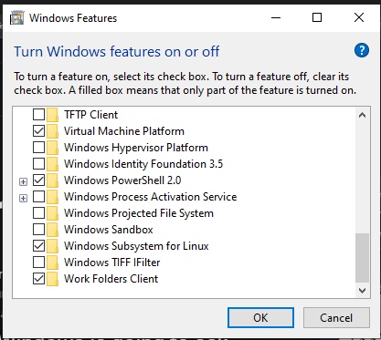
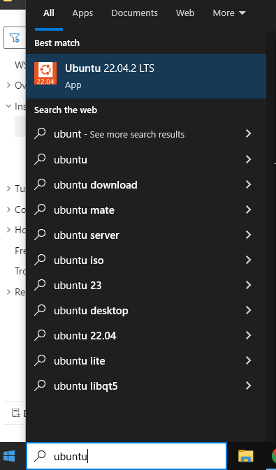
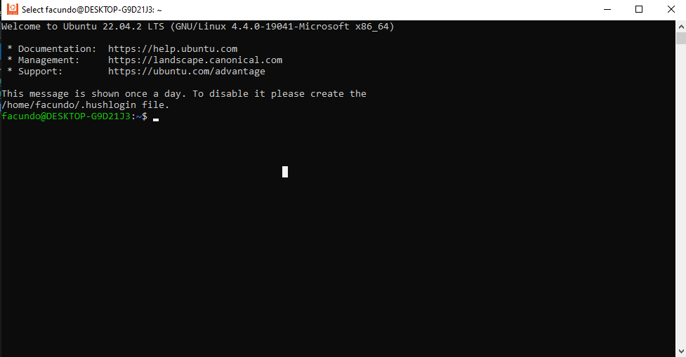
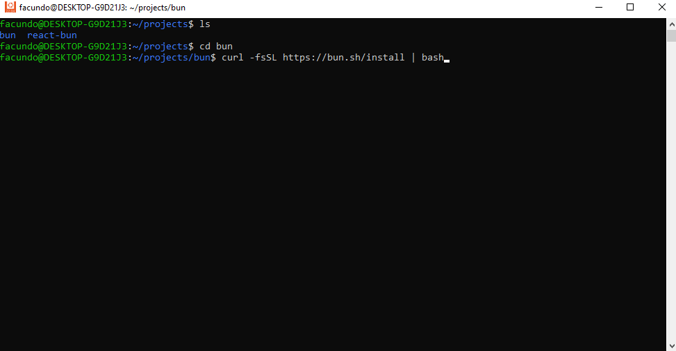

# Introducción

Este repositorio aprenderemos las bases y funcionamientos que tiene bun 1.0.

Nos basaremos de la documentación oficial de bun, la cual puedes encontrar:

- [https://bun.sh/docs](https://bun.sh/docs)

## Que vamos a aprender en este repositorio

- Repasaremos la documentación oficial de bun, y aprenderemos a instalar bun en nuestro sistema operativo (Windows o Linux).
- Veremos la API de bun, y a crear pequeños proyectos con bun.

## ¿Qué es bun.sh?

Bun es un conjunto de herramientas todo en uno para aplicaciones JavaScript y TypeScript. Se distribuye como un solo ejecutable llamado bun.

En su núcleo se encuentra el tiempo de ejecución de Bun, un tiempo de ejecución de JavaScript rápido diseñado como un reemplazo directo para Node.js. Está escrito en Zig y está impulsado por JavaScriptCore bajo el capó, lo que reduce drásticamente los tiempos de inicio y el uso de memoria.

La herramienta de línea de comandos de bun implementa un corredor de pruebas, un corredor de scripts y un administrador de paquetes compatible con Node.js, todos considerablemente más rápidos que las herramientas existentes y utilizables en proyectos de Node.js existentes con cambios mínimos o nulos necesarios.

Algunos ejemplos de comandos que podes ejecutar con bun son:

```bash
bun run start                 # run the `start` script
bun install <pkg>​             # install a package
bun build ./index.tsx         # bundle a project for browsers
bun test                      # run tests
bunx cowsay "Hello, world!"   # execute a package
```

## Instalación

Para instalar bun en tu sistema operativo, podes hacerlo de dos formas:

### 1 - Instalar bun en Windows

  Actualmente no hay una versión de bun para Windows, pero podemos instalarlo usando WSL (Windows Subsystem for Linux) y seguir los pasos de instalación para Linux.
<!-- @import "[TOC]" {cmd="toc" depthFrom=1 depthTo=6 orderedList=false} -->

- **Instalar WSL**: [https://docs.microsoft.com/en-us/windows/wsl/install-win10](https://docs.microsoft.com/en-us/windows/wsl/install-win10)
- **Asegurar que windows subsystem este activado en las windows features**:

  

- **Agregar una distribución de Linux**: [https://docs.microsoft.com/en-us/windows/wsl/install-manual](https://docs.microsoft.com/en-us/windows/wsl/install-manual)

- **Abrir la distribución de Ubuntu:**
  - Configurar nombre y password  para la configuración.
  
  
  
  

  - **Crear carpeta del proyecto e instalar bun**:
    - cd/proyecto
    - sudo apt install unzip
    - curl -fsSL <https://bun.sh/install> | bash
  
    

### 2 - Instalar bun en Linux

- Instalar bun: [https://bun.sh/docs/installation](https://bun.sh/docs/installation)
